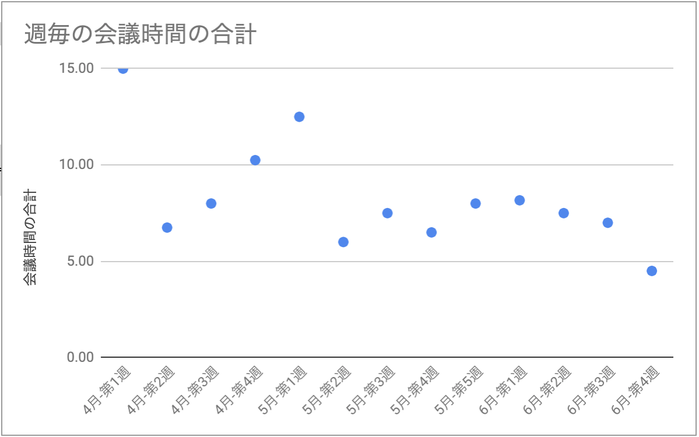

# Google Calendar の予定を CSV 一括保存する GAS/TypeScript サンプルコード

* Google カレンダーの予定をスプレッドシート (延いては CSV) に保存するサンプルコード
* GAS (Google Apps Script) 開発には clasp で TypeScript を利用
* 後のピボットテーブルでの分析のため、年月、週番号や時間も合わせて出力
  - 時間単位の分析の便宜のため、一日単位のスケジュールは出力を省いている
* 非管理者でも G Suite 組織内の自分以外のメンバーのスケジュールを取得可能
* ID リストを渡すことにより、複数メンバーのスケジュールを一括取得が可能

__(参考) 出力されたデータをピボットテーブルでグラフにした例__

<p align="center">

</p>


## Setup Node.js, TypeScript compiler and Clasp

* [README_DEV_TOOLS](README_DEV_TOOLS.md)


## Run

* GUI 上から新規 Apps Script プロジェクトを作成
* プロジェクトを開き `ファイル > プロジェクトのプロパティ` からスクリプトIDを確認
* `.clasp.json.sample` の `scriptId` を適宜書き換え `.clasp.json` とする
* 上記によりプロジェクトとの紐付けされ、本コードを push すれば実行可能になるはず
* GCalLists.ts 内の calIds 等の変数を適宜変更し Code.ts の main を実行する
  - Calendar ID は通常はメールアドレス、sheetKey はスプレッドシートの URL にある


## Development

* (参考) 新規 Apps Script プロジェクト作成コマンド例

```bash
clasp create --type standalone --title "GCal-Save-Events" --rootDir ./dist
clasp pull
# デフォルトで作成される Code.js は .ts にリネームして利用する
mv dist/Code.js dist/Code.ts
```

* プロジェクト作成後の開発サイクル
  - `.ts` を編集後そのまま push すれば自動的に `.gs` に変換される
  - (build 等の別途の操作は不要)

```bash
clasp push
clasp status
```


## Reference

* GAS のGoogle謹製CLIツール clasp
  - https://qiita.com/HeRo/items/4e65dcc82783b2766c03
* clasp が Typescript をサポートした！
  - https://qiita.com/HeRo/items/f2ce057c6b1456e896ad
* Clasp TypeScript
  - https://github.com/google/clasp/blob/master/docs/typescript.md
* Googleカレンダーの予定をGASでスプレッドシートに取り込む
  - https://qiita.com/yekcam/items/cad26ea846f911db0ab8
* G Suite 組織内ユーザーの予定を名前から取得してみる
  - https://qiita.com/Shota_Fukuda/items/5c280cece174c58ac044
  - ここに記載の `viewType` は試した限り残念ながら期待した通りに動かなかった
* GASでAdmin SDKを利用する（Directory編）その１
  - https://qiita.com/ttyokoyama/items/f41cd5f4f6c4dc2e9ee3
  - https://developers.google.com/apps-script/advanced/admin-sdk-directory#list_all_users
* Retrieve a user as a non-administrator
  - https://developers.google.com/admin-sdk/directory/v1/guides/manage-users#retrieve_users_non_admin
* GASで社内のメールアドレスと氏名を対応づけようと思ったら、苦しかった話
  - https://qiita.com/t--k/items/6c64d16e3963f5824e56
* 非管理者の場合、一度 subscribe すると、組織内の他の人の予定も読めるようになる
  - https://groups.google.com/forum/#!topic/google-apps-api-japan/yy262qzhCZw
